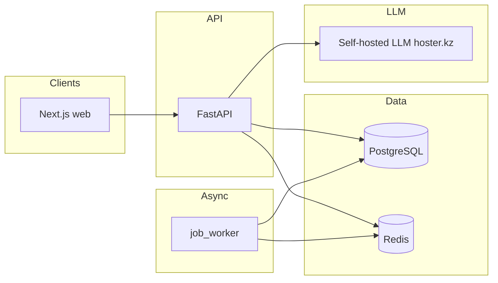

# inVision U — Admissions Platform

## 1. Project overview

**inVision U** is a monorepo for a university admissions workflow: candidates submit a structured application, automated checks and a **processing pipeline** produce **derived signals and summaries**, and the **committee** reviews applications in a dedicated UI. **AI/LLM is assistive only**—rules, validation, and human review come first; models never issue final admission decisions

Components at a glance:

- **Candidate app** — multi-section application, drafts, internal test, documents, links, video, certificates.
- **Commission app** — queues, application detail, reviews, AI-assisted summaries with **human-in-the-loop** review.
- **Validation & processing** — document/link/video checks, data verification stage (“Проверка данных”), text analysis runs, scoring heuristics.
- **Background work** — Redis-backed jobs (worker process) for async pipeline steps.

---

## 2. Core features

| Area | What it does |
|------|----------------|
| **Application** | Sectioned form (personal info, growth path, motivation, achievements, internal test, etc.), draft save, submit locks editable state where defined. |
| **Validation** | Pluggable checks on uploads, URLs, video; orchestrated validation stage with aggregated status. |
| **Data check** | “Проверка данных” — consolidates verification results; prepares compact payloads for optional LLM summaries. |
| **Derived values** | Heuristic scores, `TextAnalysisRun` records, personality profile from internal test, sidebar “attention” signals for committee. |
| **Committee** | Review workflows, sorting/filtering, recommendations; final outcome is **committee decision**, not model output. |

---

## 3. Architecture (high level)



- **Frontend** — Next.js (App Router) in `apps/web`; talks to API via `/api/v1` (rewrites in dev, public URL in prod).
- **Backend** — FastAPI in `apps/api`, SQLAlchemy + Alembic, JWT cookies + Redis refresh revocation.
- **Worker** — `scripts/job_worker.py` consumes Redis queue `admission_jobs` (run separately from API).
- **Database** — PostgreSQL: applications, sections, documents, validation artifacts, committee data.
- **Processing** — Orchestrators under `services/` and `services/stages/`; growth-path and commission AI pipelines combine **deterministic** steps with optional **LLM** calls.
- **LLM** — See [§6 LLM integration](#6-llm-integration).

Additional Node services in `apps/` (e.g. certificate/video validation) support specialized checks; they are **not** the main API but part of the broader validation story.

---

## 4. Tech stack

| Layer | Stack |
|-------|--------|
| **Monorepo** | pnpm workspaces, Turbo (`turbo.json`) |
| **Web** | Next.js 15, React 19, TypeScript, CSS modules / component styles |
| **API** | Python 3.12, FastAPI, Pydantic v2, SQLAlchemy 2, Alembic, Redis |
| **DB** | PostgreSQL 16 (Docker image locally) |
| **Queue / cache** | Redis (sessions revocation, job queue) |
| **Storage** | Local filesystem under `UPLOAD_ROOT` (swappable for object storage) |
| **Email** | Resend API for verification mail |
| **LLM** | HTTP clients to **self-hosted LLM** on **hoster.kz** (see §6) |

---

## 5. Processing pipeline

**Rough flow from candidate submit to committee:**

1. **Submit** — Application state advances; section payloads validated (Pydantic per section).
2. **Post-submit analysis** — Services (e.g. `initial_screening_service`, growth-path pipeline) run **rule-based** checks (spam heuristics, stats), optional **LLM summaries** on **already structured** inputs, persist `TextAnalysisRun` / explanations.
3. **Data verification stage** — “Проверка данных” aggregates document/link/video/certificate checks; processors may call **`LLMSummaryClient`** when `INTERNAL_LLM_SUMMARY_URL` is set.
4. **Commission** — Reviewers see summaries, validation panels, AI-assisted text **suggestions**; `ai_review_metadata` stores model metadata; **committee** records recommendations and final judgment.

**Summaries / derived values** combine: deterministic features, stored analysis runs, optional LLM JSON validated against schemas (`commission/ai/`). If LLM is disabled or fails, fallbacks keep the UI usable.

---

## 6. LLM integration

- **Self-hosted LLM only:** inference goes to **our own LLM deployment** (hosted on **hoster.kz**), not to third-party “chat API” products. Configure base URL, auth, and model id in the API environment to match your service contract—including the data-check HTTP summarizer (`INTERNAL_LLM_SUMMARY_URL` / `INTERNAL_LLM_API_KEY`) and the settings used for growth-path, commission, and block-analysis flows.
- **Role of the model:** **Auxiliary.** Order of operations: **validation → preprocessing → heuristics → compact payloads → optional LLM** for summaries/synthesis. **No autonomous admission decision.**
- **Governance:** Human-in-the-loop; LLM outputs schema-validated where implemented; audit fields as provided.

---

## 7. Horizontal scaling

The split is intentional:

- **Web** (static/serverless-friendly) and **API** (stateless workers behind a load balancer) deploy **independently**.
- **Worker** is a **separate process**; scale **N** worker replicas against the same Redis queue to increase throughput for background jobs.
- **PostgreSQL** is the system of record; Redis is for queues/ephemeral session data—scale Redis for HA as needed.
- **LLM** is out-of-band HTTP; API replicas do not need sticky sessions for inference.

You scale the tier that is hot (e.g. more API replicas for HTTP, more workers for backlog) without rewriting the app.

---

## 8. Configuration

Set environment variables in **`.env` at the repository root** (and/or in the host platform). Typical keys:

| Variable | Purpose |
|----------|---------|
| `DATABASE_URL` | SQLAlchemy URL (`postgresql+psycopg://…`) |
| `SECRET_KEY` | JWT signing (≥32 chars) |
| `REDIS_URL` | Redis for refresh revocation + job queue |
| `CORS_ORIGINS` | Comma-separated allowed web origins |
| `RESEND_API_KEY` / `EMAIL_FROM` | Transactional email |
| `APP_PUBLIC_URL` | Public site URL for links |
| `INTERNAL_LLM_SUMMARY_URL` / `INTERNAL_LLM_API_KEY` | Data-check HTTP summarizer → same **self-hosted LLM** (hoster.kz) |
| Other LLM-related env vars in API | Same deployment: endpoint, credential, model id for growth-path / commission / analysis paths |
| `UPLOAD_ROOT` | Upload directory for API |
| `STORAGE_READ_MODE` | `local_only` (default) or `local_then_proxy` for worker local-miss fallback |
| `STORAGE_PROXY_BASE_URL` / `STORAGE_PROXY_SHARED_SECRET` / `STORAGE_PROXY_TIMEOUT_SECONDS` | Worker-side storage-proxy settings (used in `local_then_proxy`) |
| `INTERNAL_STORAGE_PROXY_SECRET` | API-side secret for internal storage-proxy endpoint (`/api/v1/internal/processing/storage/...`) |
| `ENVIRONMENT` | `local` (default), `staging`, or `production` — affects commission bootstrap defaults (see below) |
| `COMMISSION_SEED_EMAIL`, `COMMISSION_ADMIN_EMAIL`, or `COMMISSION_LOGIN` | Email for the initial commission / committee login user |
| `COMMISSION_SEED_PASSWORD`, `COMMISSION_ADMIN_PASSWORD`, or `COMMISSION_PASSWORD` | Password for that user (in **production**, both email and password must be set for bootstrap to run; no dev defaults) |
| `COMMISSION_SEED_ROLE` | Optional: `viewer`, `reviewer`, or `admin` (default `admin`) |

On **API startup**, the backend runs an idempotent **commission bootstrap** (see `invision_api.services.commission_bootstrap`): if the user for the configured email does not exist, it is created; if it exists, roles are reconciled and the password is updated only when a password env var is set (local/staging) or when running in production with explicit credentials. This does not depend on shell scripts.

Frontend build/runtime may use `NEXT_PUBLIC_API_URL`, `API_INTERNAL_URL` (see `apps/web` config).

---

## 9. Local run

**Prerequisites:** Node 22 + pnpm 9, Python 3.12, Docker (recommended for Postgres + Redis).

### Infra

```bash
make infra          # docker compose: postgres + redis
```

### Database

```bash
make migrate        # alembic upgrade head
make seed           # roles + internal test questions (+ commission user via same logic as API startup)
```

Run **`make seed` at least once** on a fresh database so roles and the 40 personality internal-test questions exist. The commission user is also ensured when you run `make seed` or when the API process starts (from env; see configuration table above).

If Postgres rejects connections (wrong local role), see [Troubleshooting](#12-troubleshooting).

### API

```bash
make install-api
make backend        # FastAPI on :8000 (migrations only; see make seed for DB seed)
```

Health: `GET http://localhost:8000/api/v1/health` · Docs: `http://localhost:8000/api/docs`

### Web

```bash
make install-frontend
make frontend       # Next.js on :3000; proxies /api/v1 to API for cookies
```

### Worker (recommended for full pipeline)

```bash
make worker         # Redis BRPOP worker (scripts/job_worker.py)
```

### One-shot convenience

```bash
make install        # pnpm + Python venv + pip
make dev            # tmux: backend + worker + frontend (if tmux installed)
```

### Docker full stack

Starts **postgres**, **redis**, **certificate-validation** (OCR microservice on port 4400), **api** (migrations + internal-test seed on boot), **worker** (Redis job queue + submit heartbeat), and **web**. Compose sets **`CERTIFICATE_VALIDATION_URL`** for the API and worker to the internal service URL.

```bash
docker compose build
docker compose up
```

First-time DB (roles + full [`scripts/seed.py`](scripts/seed.py) — commission user, etc.): the API container already runs `alembic` and `seed_internal_test_questions.py` on each start. Run full seed once if you need commission roles from `.env`:

```bash
docker compose run --rm api python /app/scripts/seed.py
```

API `http://localhost:8000`, web `http://localhost:3000`, uploads in `upload_data` volume. The **worker** uses the same `DATABASE_URL` / `REDIS_URL` as the API so candidate submit and data-check jobs match production.

### Other Makefile targets

`make help` — full list · `make smoke` — API pytest + web vitest · `make test-e2e` — pipeline e2e test · `make check-invariants` — pipeline integrity script.

---

## 10. Deployment (overview)

| Piece | Typical target |
|-------|----------------|
| **Frontend** | **Vercel** — set project **Root Directory** to `apps/web`; build/install commands are in [`apps/web/vercel.json`](apps/web/vercel.json) (monorepo `pnpm` + Turbo). |
| **Backend** | **Railway** (or any container host) — build from `infra/docker/Dockerfile.api`; entrypoint runs migrations, `seed_internal_test_questions.py`, then uvicorn. Set **`COMMISSION_ADMIN_EMAIL`** and **`COMMISSION_ADMIN_PASSWORD`** (or equivalent `COMMISSION_SEED_*` vars) with **`ENVIRONMENT=production`** so the commission user is created on first API startup. |
| **Worker** | Separate **Railway** service: build with **[`infra/docker/Dockerfile.worker`](infra/docker/Dockerfile.worker)** (Python image). Do **not** use Railpack/Node auto-build for the worker — there is no `python3` there. Same `DATABASE_URL` + `REDIS_URL` as API. |
| **Certificate validation** | Separate **Railway** (or similar) **Docker** service: build from **[`infra/docker/Dockerfile.certificate-validation`](infra/docker/Dockerfile.certificate-validation)** (repo root, context `.`). Image includes **Tesseract** (eng/rus/kaz), **ffmpeg**, and **Node** runtime for **sharp**. The API and worker must set **`CERTIFICATE_VALIDATION_URL`** to the internal URL of this service (e.g. `https://<cert-service>/certificate-validation/validate`). Optional: **`CERTIFICATE_VALIDATION_HEALTH_URL`** (defaults to same origin as `/health` derived from `CERTIFICATE_VALIDATION_URL`). Same **`DATABASE_URL`** as the API if the service persists results. |
| **Database / Redis** | Managed Postgres + Redis with URLs wired into API and worker. |
| **LLM** | Same **self-hosted** service on **hoster.kz** (endpoint + secrets in API env, including `INTERNAL_LLM_*` for summarizer). |

Redeploy API after schema changes; ensure **both** API and worker share the same `DATABASE_URL` / `REDIS_URL` where applicable.

### Application submit (`POST /candidates/me/application/submit`)

Submit is **blocked with HTTP 503** unless the processing pipeline is considered ready:

1. **Redis** — API must reach Redis (`REDIS_URL`); otherwise the API returns `503` with code `submit_pipeline_redis` (check API logs: `submit_readiness_failed reason=redis_unreachable`).
2. **Worker** — a separate process must run the job worker ([`scripts/job_worker.py`](scripts/job_worker.py)) with the **same** `REDIS_URL` and `DATABASE_URL`. It refreshes Redis key `invision:worker:heartbeat` (~every 30s). If this key is missing, submit returns `503` with code `submit_pipeline_worker` (logs: `worker_heartbeat_missing`).
3. **Queue enqueue** — if enqueuing post-submit jobs fails after the above checks, submit returns `503` with code `submit_queue_enqueue` and structured `enqueue_context` / `enqueue_error` in the JSON `detail` for operators.

**Production checklist:** provision Redis → deploy API with `REDIS_URL` → deploy a **second** Railway service for the worker **via Docker** → confirm heartbeat exists (e.g. `redis-cli EXISTS invision:worker:heartbeat`). Without worker + Redis, candidates will always see the “service unavailable” message on submit; this is intentional so the application is not marked submitted until jobs can be queued.

#### Railway worker service (Docker)

1. Create a **new** Railway service from the **same GitHub repo**.
2. Set **builder** to **Dockerfile** (not Railpack/Nixpacks Node).
3. **Dockerfile path:** `infra/docker/Dockerfile.worker` · **root directory:** repository root (`.`).
4. **Variables:** same `DATABASE_URL` and `REDIS_URL` as the API (and `SECRET_KEY` if your settings load it for DB/session).
5. **Do not** set a custom start command that runs `python3` on a Node image — that produces `python3: command not found`. The worker image must be built from `Dockerfile.worker` above.

---

### `python3: command not found` on Railway worker

The worker was likely built as a **Node** app (Railpack). Switch that service to build **`infra/docker/Dockerfile.worker`** instead.

---

## 11. Notes / important constraints

- **Admission outcome** is **committee** responsibility; AI output is advisory and bounded by schemas and feature flags.
- **Internal test** expects **40** active questions in DB; production API image seeds them on startup; misconfiguration logs a warning at API boot.
- **Uploads** default to local disk; production should set `UPLOAD_ROOT` to persistent storage or replace with S3-compatible adapter later.
- Validation microservices (`apps/certificate-validation`, `apps/video-validation`, orchestrator) may run as separate deploy units—coordinate URLs/env with the main API.

---

## 12. Troubleshooting

### `make infra` prints “infra is up to date”

GNU Make can treat `infra/` as a directory target. The root `Makefile` declares **phony** targets so `make infra` always runs `docker compose up -d postgres redis`.

### `FATAL: role "invision" does not exist`

Port 5432 may be bound to a **non-Docker** Postgres. Either free the port for Docker Postgres, or create the role/DB (`make init-db` or `scripts/sql/init_invision_role_and_db.sql`), or point `DATABASE_URL` at an existing role.

### Internal test tab shows “questions not configured”

Ensure `GET /api/v1/internal-test/questions` returns **40** items after deploy; run `PYTHONPATH=apps/api/src python scripts/seed_internal_test_questions.py` against the target DB if needed.

---

## 13. Commands cheat sheet

| Task | Command |
|------|---------|
| Install all | `make install` |
| Migrations | `make migrate` |
| Seed roles/questions | `make seed` |
| Backend | `make backend` |
| Frontend | `make frontend` |
| Worker | `make worker` |
| Docker stack | `make docker-up` / `make docker-down` |
